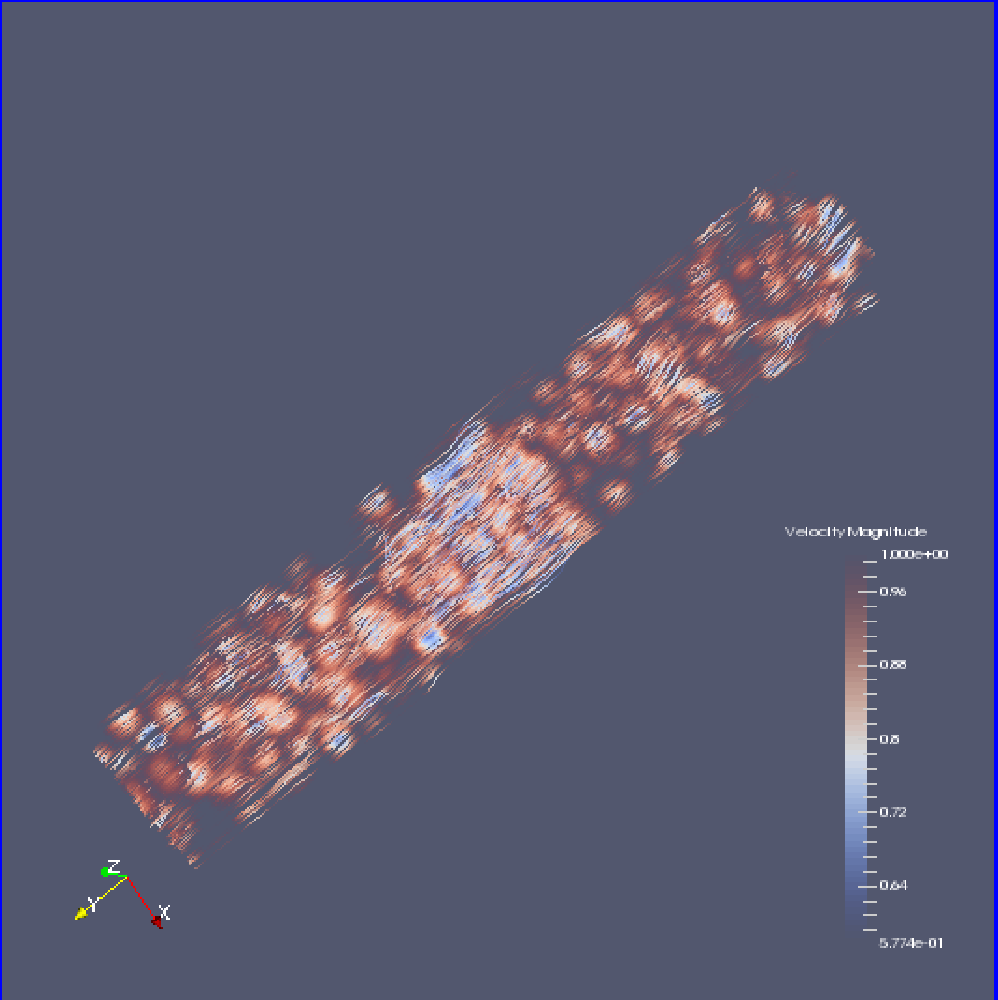

### Idea generations

#### Idea 1
#### Text-based Visualization
1. Using the RGB vectors as direction vectors, create vector Glyphs, hedgehog-style
2. Point cloud of sentiment?

3. Volume Rending / Ray casting / Slice based, some kind of color compositing/transfer function/LUT

4. Streamlines Tensors. These would be the DTI tracktography images you see.
  - A clustering method would have to be done before generating the streamlines, in order to determine the connected streamlines. This would give solid tensor lines.
  - I could then threshold this so we only saw the most well connected etc.
  - Or do seed based generations...the possibilities are endless!

5. Marching Cubes/ Isosurface volume rendering
