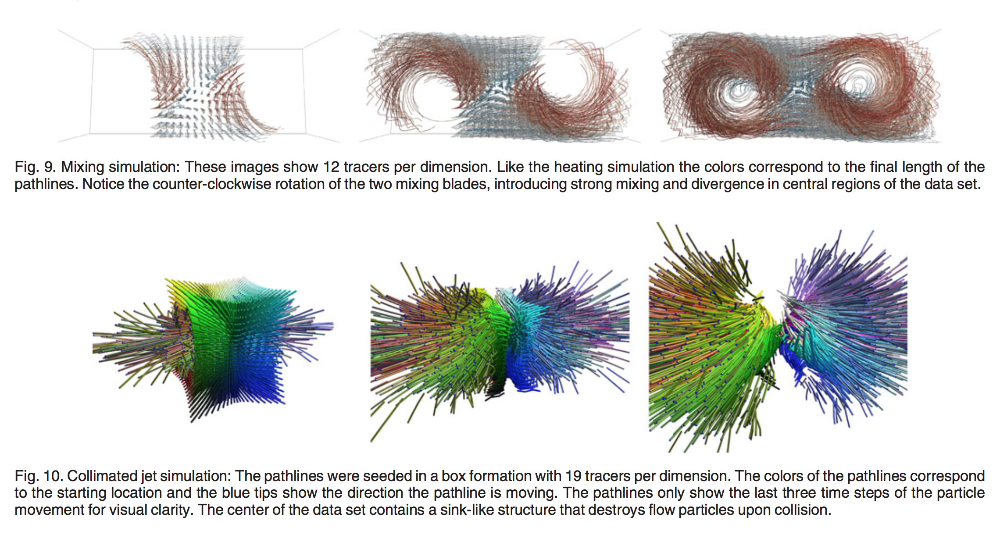
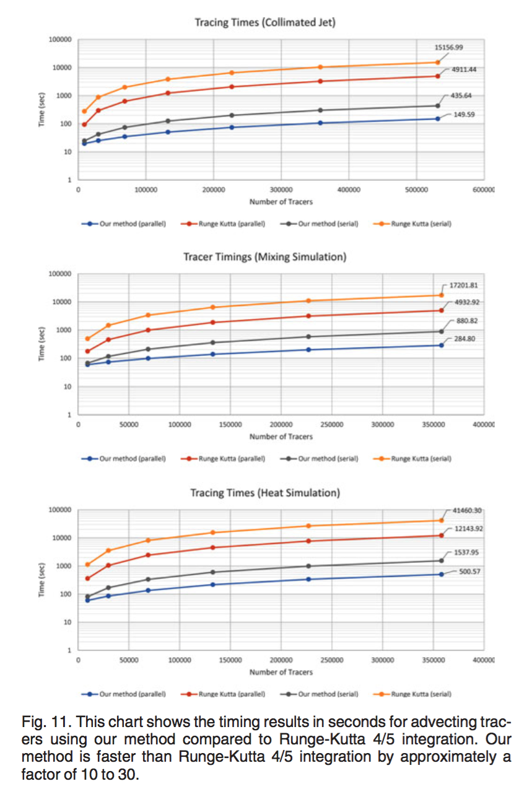
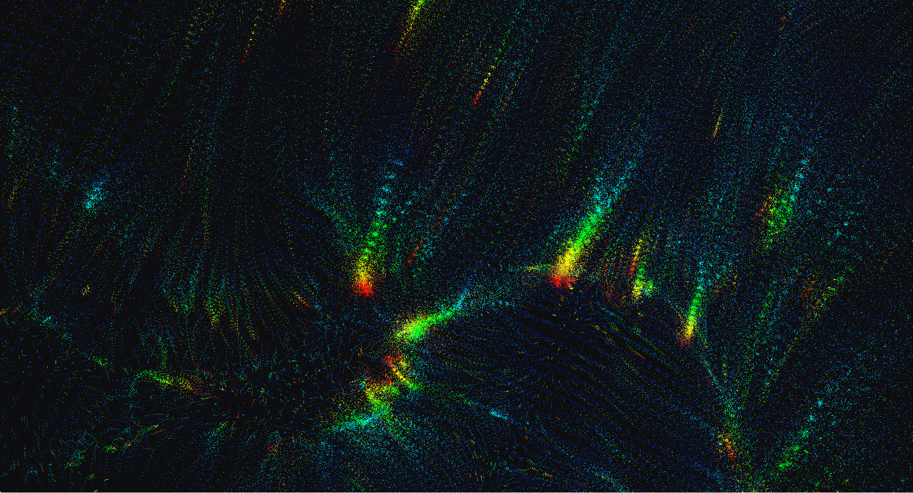
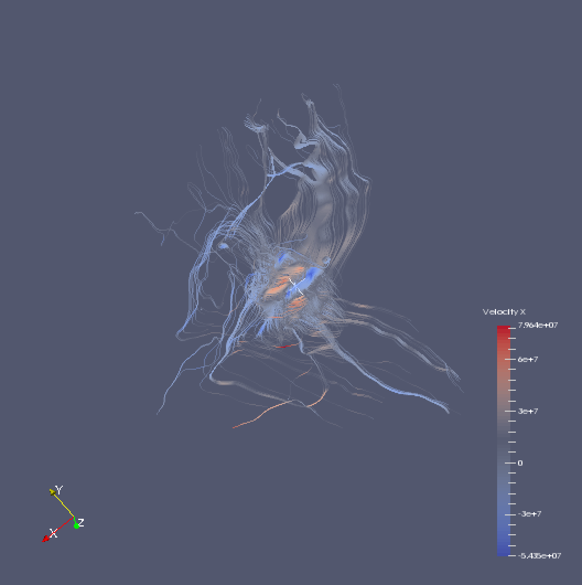

## Interpolation-Based Pathline Tracing in Particle-Based Flow Visualization, 2014


### Confusion
- Why didnt I read this paper sooner?!
- I feel like this was an obvious next step with regards to flow-based visualizations
- Some of the details of fluid simulations are a little over my head at the moment...

### Context
Traditional methods of particle tracing, that is, numerical intergeneration of an underly vector field, are frequently computationally expensive. This is especially true when it comes to particle-based flow fields as the computational complexity involved in interpolating the field increases due to their unstructured nature. The problem is due to the fact that one must calculate the velocity of an arbitrary point within the flow field, which requires identifying a particle neighborhood, an expensive operation on its own, before performing the interpolation. These problems are then compounded by the fact that numerous lookups are made at every step in the integration process in order to preserve accuracy.

### Contributions
The main contributions of this paper, as highlighted by the authors, include:
- The elimination of the integration of the underly velocity field and using the position of the particle itself.
- Modified k-d tree for rapid identification of arbitrary particle neighborhood.
- Offer an evaluation of their approach against existing methods used for tracing scattered, particle-based flow fields.

While I dont disagree with their contributions, I want to highlight the first approach as being, in my opinion, the biggest contribution. Having done previous work involving particle-based field data (though not explicitly flow-field) I can speak to the challenges involved in trying to generate path-lines.
<!-- *Comment*
I feel like this technique should have already been developed. Im very happy that they did it though
 -->

### Structure
The paper give a brief, but thorough overview of the related works done in flow visualizations, highlighting that the vast majority of these works focusing on techniques which improve the sampling efficiency of the various integration methods available. This overview was itself quite useful in terms of understanding the current body of literature on the technique, highlighting numerous creative and interesting solutions. The overview also touches on techniques as they are related to particle-based flow fields, highlighting the emphasis on rendering surfaces or isosurfaces for particularly large dataset. The remainder of the article touches on the motivations for the technique that they developed as well as a detailed, step-by-step analysis of each component of their technique. The paper closes with a detailed evaluation of their method against the more commonly used integration methods used in flow-field visualizations, presenting quantifiable evidence to support their claims for a dynamic and efficient technique for particle-based flow visualizations.

### Results
> Discuss the RESULTS of the paper. What specific conclusions does it make? What advice does it give it to the target audience?

The authors compare their technique to more common integration methods, specifically adaptive Runge-Katta, examining performance (see figure below). Because this technique only requires a single lookup inside a particle-neighborhood table per time-step, as opposed to the often hundreds of interpolation steps required by standard integration methods, advecting particles results in a speed up of a factor of 10 - 30 depending on the size of the data!


To measure accuracy, they acknowledged that due to the nature of particle-based flow data, its difficult to establish a quantifiable measure of comparison, unlike the Eulerian representations which maintain velocity vector field, which allows for the quantification and identification of the trajectory of a particle. Thus it requires the establishment of a Ground truth by which a comparison can be made.


### Evalute
I found this to be a very thoroughly described and well thought out technique and paper which thoughtfully identified a particular problem within the space of particle-based flow visualizations. They clearly and carefully laid out the implementation details of their technique and provided clear explanations for why the made the choices that they did. Furthermore, their evaluation of the technique against current integration methods was frankly, very well done. The authors were careful to note that their technique was developed only in support of *Path line* generation and not to other common flow-visualization techniques such as streak lines and time lines. They also suggest future directions which could include implementing the technique on a GPU to take advantage of the parallelization it offers, highlighting the fact that their technique is well suited to parallelization.

### Relevance

This article is relevant to my research interests because I am interested in unstructured pathline tracing,
particularly as it relates to my DarkSky project. Pathlines, Tracelines, and other Flow type visualizations
are a technique of great interest to me at the moment. I am exploring the use of Flow and path-line
visualization techniques as it applies to unconventional data, for example Text Based visualizations, or
tracing the flow of energy through a complex biological or ecological system as those models used in in the
aforementioned domains.


---
In another, somewhat unrelated application of this technique, their neighborhood lookup approach could potentially be used in other types of applications such as path generation or assisting a multi-agent system when looking for things like predators or food etc.


### Authors Comments
I really enjoyed this paper. I stumbled upon it somewhat by accident and I am so glad! I wish I had found it sooner while was working on DarkSky. One of my main desires of that project was to examine the trajectories of the Particle data themselves over the Halo structures. I felt it would be interesting to generate a flow filed like image. However due to the lack of a structured format, and no velocity field data, I had to force one onto the dataset, resulting in
highly inaccurate (though cool looking) information.




### Bibtex
```
@article{chandler2015interpolation,
  title={Interpolation-based pathline tracing in particle-based flow visualization},
  author={Chandler, Jennifer and Obermaier, Henriette and Joy, Kenneth and others},
  journal={Visualization and Computer Graphics, IEEE Transactions on},
  volume={21},
  number={1},
  pages={68--80},
  year={2015},
  publisher={IEEE}
}
```