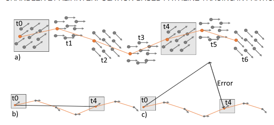

# Week 1

## Interpolation-Based Pathline Tracing in Particle-Based Flow Visualization, 2014

### Context
 > Describe the CONTEXT of the paper. What problem does it explore? Why is exploring this problem important? Who does this problem affect? Who would benefit from reading this paper?

Traditional methods of particle tracing, that is, numerical intergeneration of an underly vector field, are frequently computationally expensive. This is especially true when it comes to particle-based flow fields as the computational complexity involved in interpolating the field increases due to their unstructured nature. The problem is due to the fact that one must calculate the velocity of an arbitrary point within the flow field, which requires identifying a particle neighborhood, an expensive operation on its own, before performing the interpolation. These problems are then compounded by the fact that numerous lookups are made at every step in the integration process in order to preserve accuracy.

### Contributions
> What are the CONTRIBUTIONS of the paper? What specifically does it present that is new and interesting?

The main contributions of this paper, as highlighted by the authors, include:
- The elimination of the integration of the underly velocity field and using the position of the particle itself.
- Modified k-d tree for rapid identification of arbitrary particle neighborhood.
- Offer an evaluation of their approach against existing methods used for tracing scattered, particle-based flow fields.

While I dont disagree with their contributions, I want to highlight the first approach as being, in my opinion, the biggest contribution. Having done previous work involving particle-based field data (though not explicitly flow-field) I can speak to the challenges involved in trying to generate path-lines.
<!-- *Comment*
I feel like this technique should have already been developed. Im very happy that they did it though
 -->

### Structure
> Summarize the STRUCTURE of the paper. How do the authors present their ideas? What steps do they take to present their contributions and then convince you of the validity of these contributions?

The paper give a brief, but thorough overview of the related works done in flow visualizations, highlighting that the vast majority of these works focusing on techniques which improve the sampling efficiency of the various integration methods available. This overview was itself quite useful in terms of understanding the current body of literature on the technique, highlighting numerous creative and interesting solutions. The overview also touches on techniques as they are related to particle-based flow fields, highlighting the emphasis on rendering surfaces or isosurfaces for particularly large dataset. The remainder of the article touches on the motivations for the technique that they developed as well as a detailed, step-by-step analysis of each component of their technique. The paper closes with a detailed evaluation of their method against the more commonly used integration methods used in flow-field visualizations, presenting quantifiable evidence to support their claims for a dynamic and efficient technique for particle-based flow visualizations.

### Results
> Discuss the RESULTS of the paper. What specific conclusions does it make? What advice does it give it to the target audience?

The paper concludes that

### Methods
> What are the METHODS used to come to these results? Is it a user study, a survey, an interview? Does it use statistical analyses? Do the methods make sense for the problem? Is there anything that might have been left out? What assumptions did the authors make when they chose these methods? How many people were involved in the user study or interview? Do you think the addition of more studies would help convince you that their results were meaningful?

### Technologies
> What TECHNOLOGIES does the paper explore? Does the paper make sense only in terms of specific device or technology, or would the contributions of the paper apply to multiple technologies, or even future technology?

### Figures
> Describe the FIGURES in the paper. Do they help explain the main ideas of the paper? Do any of the figures show some sort of interaction techniques? Could you redesign the figures so that they would be more useful or clear? What would the authors of the Sketching User Experiences Workbook say about them?

### Confusion
> List any words or ideas that you don’t understand or that cause CONFUSION. Look up the meaning of these words. Do the references help you make sense of technical phrases or jargon? Provide the definition of the words that’s relevant to the paper. If you can’t figure it out, what is your best guess?

### Evalute
> How would you EVALUTE the effectiveness of this paper and the research it describes? How do you think the authors could build upon or improve the contributions of the paper? Is there anything that was left out? Can you think of future research that would build upon this paper?

### Relevance
> Explain the RELEVANCE of the article toward your research interests in general and especially toward the articles that you are writing in conjunction with this class. Before the mid-point of the semester, the papers you choose should be important precursors that can be discussed in the “related work” section of your articles.

This article is relevant to my research interests because I am interested in unstructured pathline tracing,
particularly as it relates to my DarkSky project. Pathlines, Tracelines, and other Flow type visualizations
are a technique of great interest to me at the moment. I am exploring the use of Flow and path-line
visualization techniques as it applies to unconventional data, for example Text Based visualizations, or
tracing the flow of energy through a complex biological or ecological system as those models used in in the
aforementioned domains.

### Authors Comments
I really enjoyed this paper. I stumbled upon it somewhat by accident and I am so glad! I wish I had found it sooner while was working on DarkSky. One of my main desires of that project was to examine the trajectories of the Particle data themselves over the Halo structures. I felt it would be interesting to generate a flow filed like image. However due to the lack of a structured format, and no velocity field data, I had to force one onto the dataset, resulting in
highly inaccurate (though cool looking) information.

