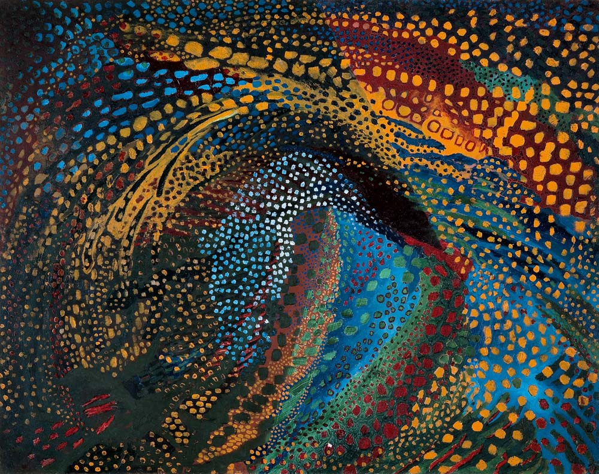
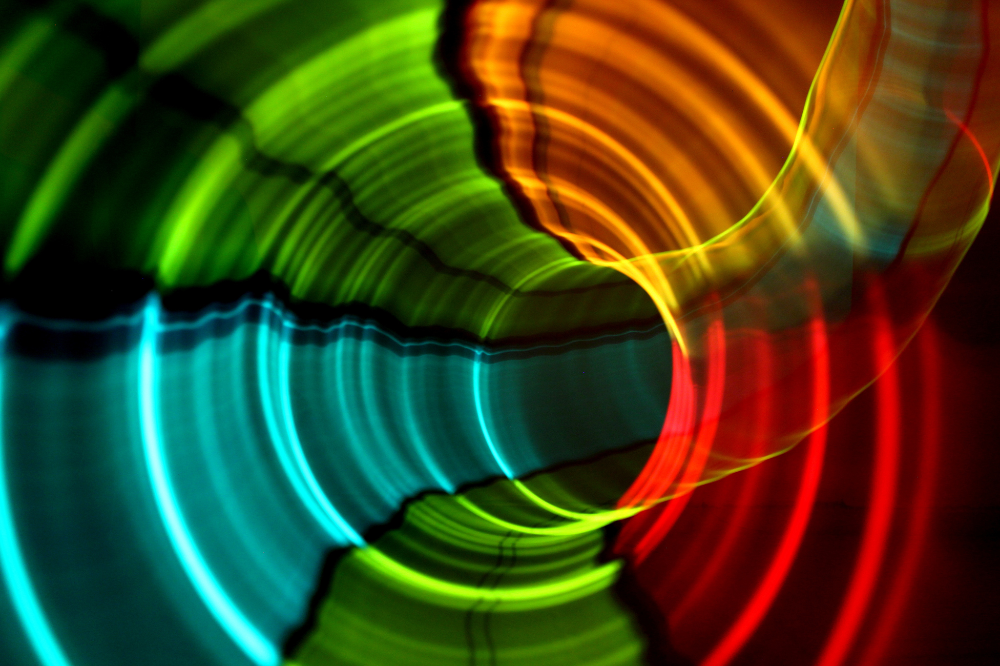
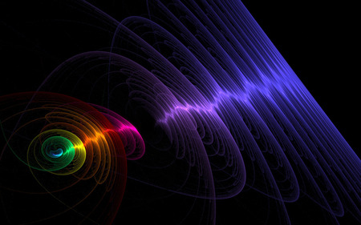

### Mikahil Matiushin

####Painterly Musical Construction
>Zhivopisno muzykal'naia konstruktsiia

### The Artist
Mikahil Matiushin was a Russian composer and amatuer painter who explored his own concept of *"The Fourth Dimension"* by connecting visual and musical arts. A leader of Russian avant-garde, he tried to prove that man might be able to expand the limits of ones vision of the surrounding world thereby utilizing his natural physiological abilities to their full potential. He believed that the artist, who are students of the reality, cannot simply paint fragments of that reality but instead the whole infinite and unending space as a single existence of object and the environment free of all unnecessary details. Some cool shit, man.

### About the work
This painting then is a clear interpretation of that idea, incorporating his interest in the correspondence between sounds and colors. "Sound consists of the very same waves as light". It was his desire to develop a more acute mode of perception through the fusion of sound, color, and light. All of his works explored these concepts in some form or another.

What I find the most interesting about this piece is the use of **points** of color and how they seem to move and 'swirl' around each other but maintain some semblance of order. There is structure to this image, even if you dont see it at first. Its bright, its loud, its chaotic, yet it has dimension and depth to it. Somehow he conveys a sense of fluidity and expansion. It reminds me of **Space** and the *Universe*. Infinitely large and expansive, this swirling mass of color and noise and light. Its beautiful.

### Excerpts from Victory over the Sun

### Strategy
My first inclination is to implement this scene as a Point Cloud set on a segmented multicolor background. It appears there are several "sections" of color, some dark green, some sky blue, black, etc. Then I would create "classes" of color clouds, which range in size and color and even shape. The tricky part will be "correctly" positioning the points. There are of course plenty of spiral functions that could be applied, and as a naive approach that is surely what I will do as a first pass. However, it would be interesting and for that matter more accurate to the artists vision if I could somehow incorporate actual sound waves and somehow combine or at least match them to color waveforms. That would be pretty sweet.

#### Inspiration

>Images taken from [here](http://www.magic4walls.com/wallpaper/abstract-sound-wave-music-colored-aurora-art-photo-background-28316.html)
and [here](http://cache.desktopnexus.com/thumbseg/62/62040-bigthumbnail.jpg) respectively.
