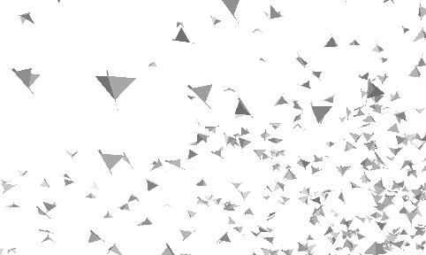
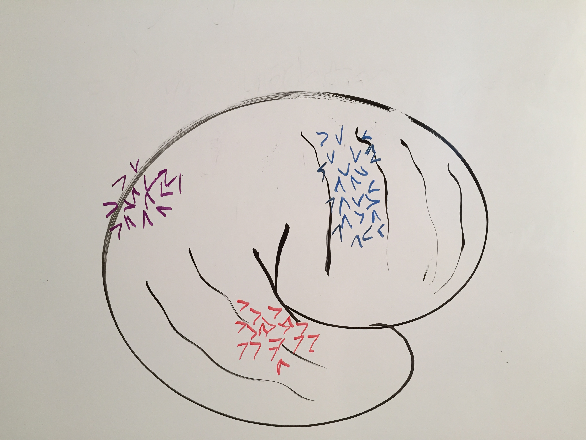
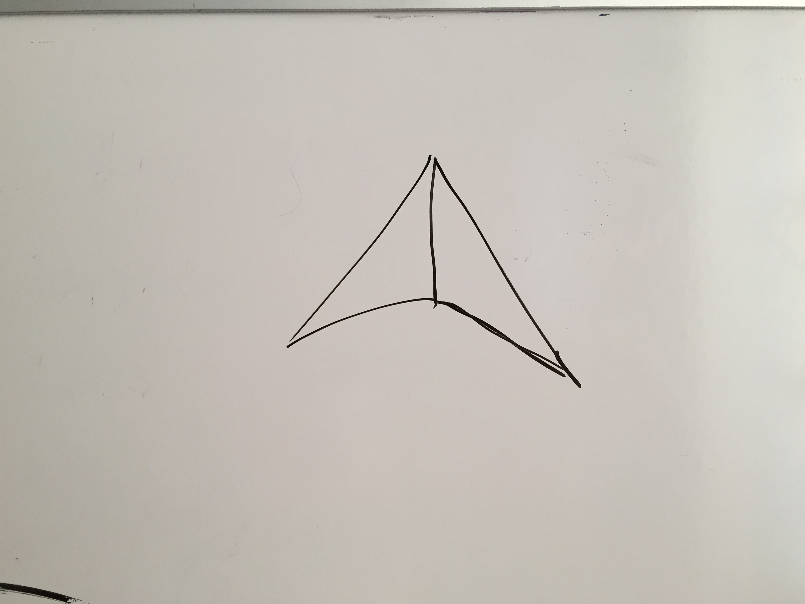
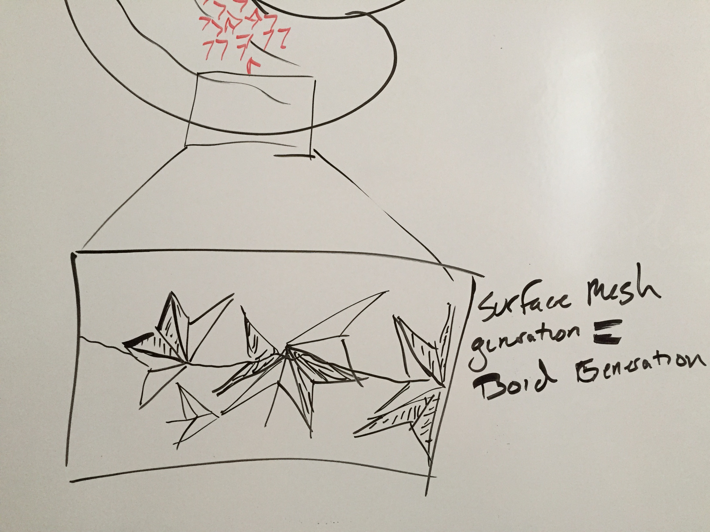
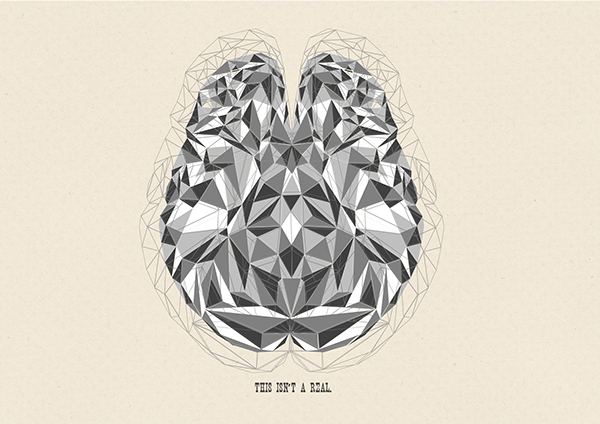
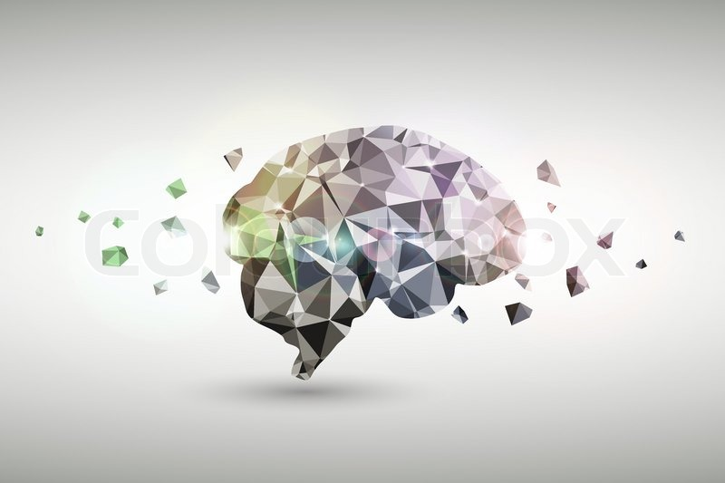
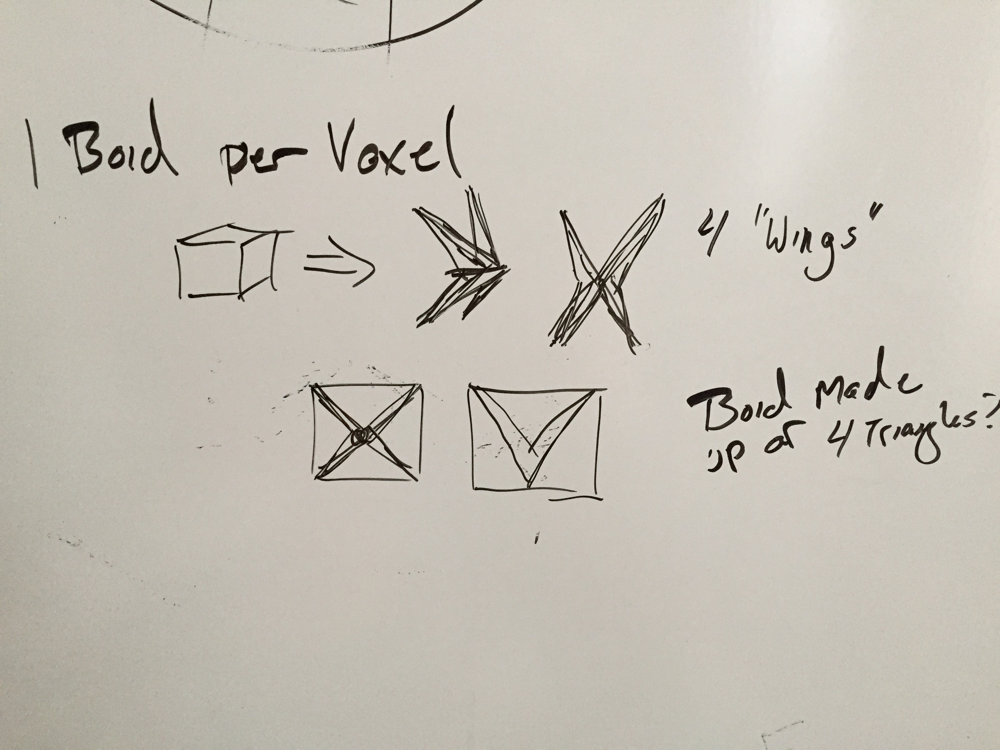
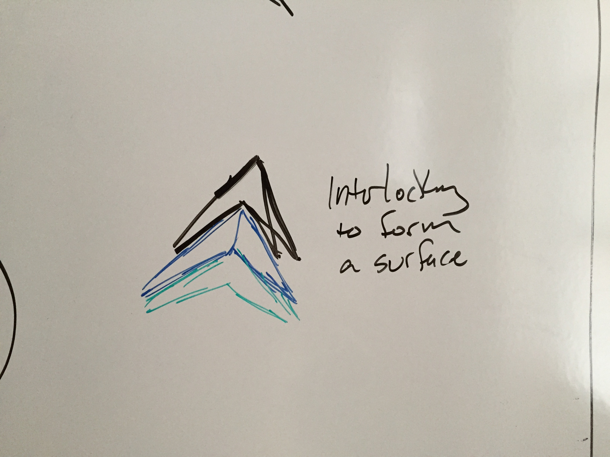

#### Idea: Boid Brains
This is a more artistically inclined visualziation with some opportunities for scientific application.
Combining the flexibility of point-cloud/particle simulations and 'boid' agent simulations mapped to real neuroimaging data, be able to show brain changes over time using motion

---

It was inspired by this [Three.js example](http://threejs.org/examples/#webgl_gpgpu_birds) 

- Highlight the inherent uncertainty of fMRI data by visualizing the probability of the dataset, typically a P-value

- Boids will be represented as a pair of triangles, or perhaps collection of triangles.

- Boids will be generated via mesh decomposition(?) converting the surface mesh into a series of dual triangles which represent the brain. 

>Image was created by an artist named [Amirul Roslan](https://www.behance.net/gallery/18536531/polygon-brain)

>Image was found [here](https://www.colourbox.com/vector/abstract-business-brain-polygonal-design-concept-bright-background-vector-illustration-vector-11839793)

-Alternatively, Boids could (and probably should) represent a single voxel, either abstractly, with a single boid or more concretely by having multiple boids represent the voxel of interest

