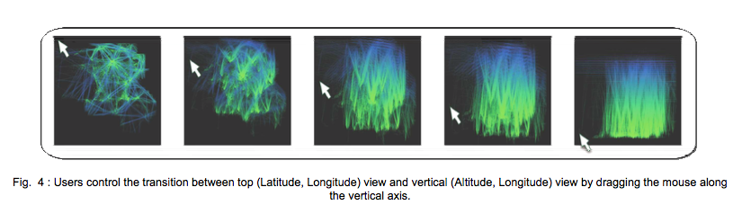

### **FromDaDy : spreading aircraft trajectories across views to support iterative queries**
Christophe Hurter, Benjamin Tissoires, St ́ephane Conversy


### Context
>- Describe the CONTEXT of the paper. What problem does it explore? Why is exploring this problem
important? Who does this problem affect? Who would benefit from reading this paper?

Aircraft Trajectory data are large and complex, with even a days worth of data showing a massive tangle of trajectory lines and paths that are difficult to parse. Often these data are rife with errors and inconsistencies that can only be sussed out through visual analysis. With few data points it is relatively easy to spot and correct these errors, but when the dataset frequently ranges in the millions, the issue of scale becomes untenable quickly. For air traffic controllers and others, this data is critical in order to understand and manage the national and international airspaces. Given the constraints due to size and inherent uncertainty in the data, there is a clear need for a tool or technique which can address these problems.

### Contributions
>What are the CONTRIBUTIONS of the paper? What specifically does it present that is new and
interesting?

This is where *FromDaDy* comes into play. *FromDaDy* ("**FROM DA**ta to **D**ispla**Y**") is a tool which aims to solve the problem of expressing queries on these large scale datasets simply and accurately, given the constraints of size and uncertainty of the datasets. The main contribution of this paper, as outlined by the author, is in the way users are able to *spread* data *across* views. Through a careful mix of design customizations and simple interactions, a user can filter, remove, and add trajectories in an iterative manner until they have extracted a set of relevant data, which ultimately formulates complex queries.

### Structure
>Summarize the STRUCTURE of the paper. How do the authors present their ideas? What steps do they take to present their contributions and then convince you of the validity of these contributions?

The overall structure of the paper follows the standard model, that is, a discussion of the related works, design decisions, implementation details, and finishes off with a comparison task using a couple test datasets to highlight the workflow and usefulness that this application provides. While no quantitative experiments are performed the analysis and demonstrations of functionality are thorough and thoughtful.

### Technologies
>What TECHNOLOGIES does the paper explore? Does the paper make sense only in terms of specific device or technology, or would the contributions of the paper apply to multiple technologies, or even future technology?

This particular application was implemented in C# with the .Net framework for its interface implementations and DirectX for GPU programming. In order to applying the brushing technique over 5 million points it was necessary to harness the inherent parallelism of GPU hardware to tackle the technological challenges that implies. Using a fragment shader and the render-to-texture feature technique as developed by **M. Harris 2005**, which controls the selection of brushed points, and geometry shaders to handle drawing of the trajectory lines themselves, FromDaDy is able to display up to 5 million data points in real-time.

### Figures
>Describe the FIGURES in the paper. Do they help explain the main ideas of the paper? Do any of the figures show some sort of interaction techniques? Could you redesign the figures so that they would be more useful or clear? What would the authors of the Sketching User Experiences Workbook say about them?

 The figures describing the Brush, Pick, and Drop interactions are clear and easy to understand with little textual context needed to describe the technique. When quickly scanning the paper, it was immediately clear what operations the technique performed and the result it provided.

---

 The figures describing the boolean operations was less clear and took a few moments to understand the operations it was trying to highlight. This was due in part to mashing two related figured close together making it look at times like one larger figure. It was also a little confusing showing the 'original data'

---

 This figure was a little unclear at first, but the caption does a good enough job of providing the necessary context


### Evalute
>How would you EVALUTE the effectiveness of this paper and the research it describes? How do you think the authors could build upon or improve the contributions of the paper? Is there anything that was left out? Can you think of future research that would build upon this paper?

Overall I found the paper to be clear in terms of its description of the technique. At points I felt they over described an operation to the point that I found it somewhat confusing. For example the boolean operations, while an important feature probably could have done without the figure. Another frustration I had was with the "Rolling the Dice" reference. At no point in the paper do they really explain what that technique was in any detail that provided useful context. While its not unreasonable to simply look the technique up on my own, nothing about the name of the technique explained the actual operation, which at this point I am still confused on. Further, the figure was difficult to understand and left me more confused than not.


### Relevance
>Explain the RELEVANCE of the article toward your research interests in general and especially toward the articles that you are writing in conjunction with this class. Before the mid-point of the semester, the papers you choose should be important precursors that can be discussed in the “related work” section of your articles.

This paper is particularly relevant to my current work on the "**DarkSky**" project which examines Dark Matter Halo trajectories over time. A technique such as this one is compelling both in that it is designed with large scale datasets in mind, which the DarkSky dataset certainly fits, as well as offering a compelling means by which to examine the interactions of the Halo Merger Trees across time. The iterative selection and filtering strikes me as particularly interesting and potentially useful, however one difference between this technique, which is applied against airline trajectories, and the Dark Matter Halo dataset is the trajectories themselves. For the most part, airlines travel in a *mostly* straight or direct path, with few serious shifts and changes. The Halo data by contrast is quite unpredictable and chaotic. The Halo data is also 4 dimensional, making full use of all dimensions. While there is certainly a time component to the airline trajectory, they are, for all intents and purposes, 2 dimensional data carry only a latitude and longitude. This provides a challenge then when trying to dynamically filter and select Halo trajectories as it is entirely plausible that trajectory of interest is occluded by one not so interesting.

### Citation
```
@article{hurter2009fromdady,
  title={Fromdady: Spreading aircraft trajectories across views to support iterative queries},
  author={Hurter, Christophe and Tissoires, Benjamin and Conversy, St{\'e}phane},
  journal={Visualization and Computer Graphics, IEEE Transactions on},
  volume={15},
  number={6},
  pages={1017--1024},
  year={2009},
  publisher={IEEE}
}
```